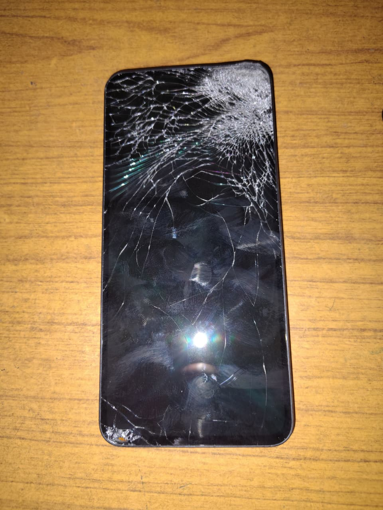
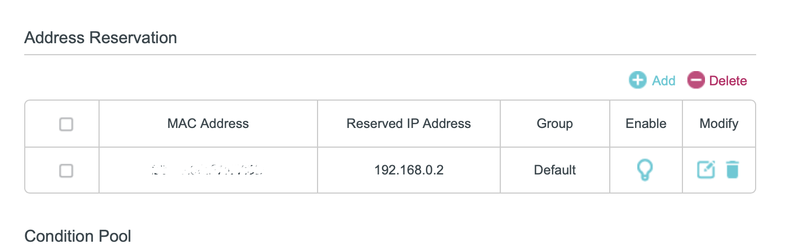
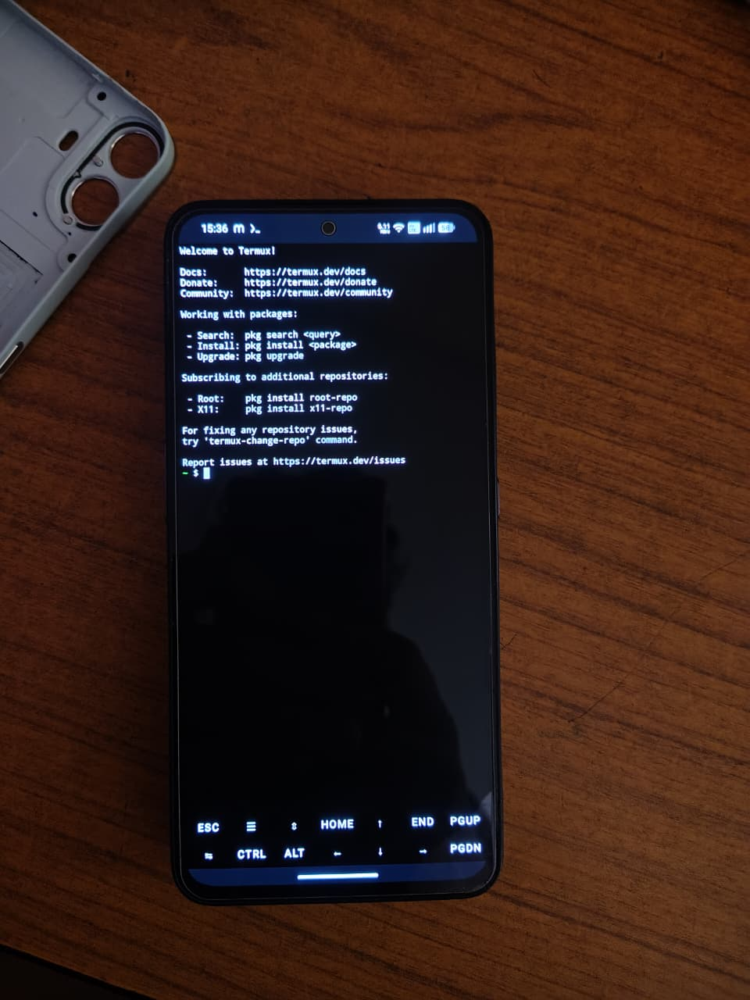
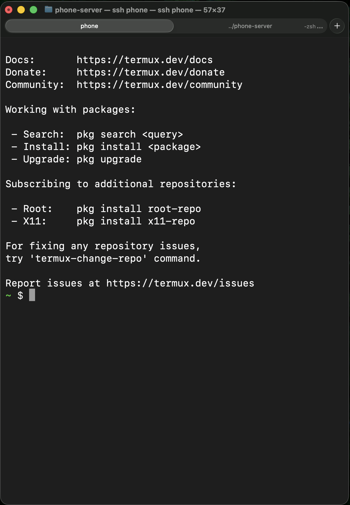
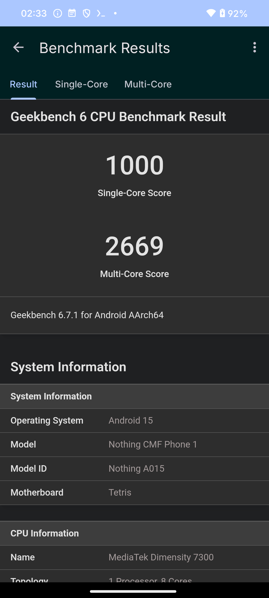

# Pocket Cloud: Repurpose an Old Android Phone

Turn an old Android phone sitting unused in a corner into your own dedicated
personal cloud.

The phone can run APIs, websites, scheduled jobs, databases, and automation. This
repository includes a small API as a working example.

You can also use it as an always-on home for AI tools such as
[Hermes Agent](https://github.com/NousResearch/hermes-agent/blob/main/website/docs/getting-started/installation.md),
which officially supports Android through Termux, or
[OpenClaw](https://docs.openclaw.ai/start/getting-started). OpenClaw's Android
setup may require additional compatibility steps, so follow its current official
documentation.

  

## **Important: your network is the biggest limitation**

The phone must stay powered and connected to reliable Wi-Fi. The service goes
offline if the phone, router, power, or internet connection fails. Cloudflare
Tunnel gives you a stable public URL, but it cannot provide redundancy or an SLA.

Live instance:

- [Health](https://phone.lohitcode.com/health)
- [Phone metrics](https://phone.lohitcode.com/api/v1/system)
- [Source code](https://github.com/lohitcode/phone-server)

For deeper details, see [DEPLOYMENT.md](DEPLOYMENT.md). Coding agents should also
read [AGENTS.md](AGENTS.md).

## Fastest setup: use an AI coding agent

Clone the repository on your development computer:

~~~bash
git clone https://github.com/lohitcode/phone-server.git
cd phone-server
~~~

Open the folder in Codex, Claude Code, or another coding agent and paste:

~~~text
Read README.md, DEPLOYMENT.md, and AGENTS.md completely. Guide me through the
Android phone setup one step at a time. Check each prerequisite and command
before moving forward. Help me configure my reserved phone IP, ADB, Termux SSH,
deployment, Termux:Boot, and Cloudflare Tunnel. Never expose secrets or run a
destructive command. Ask me to complete phone or router actions when needed.
~~~

The agent can verify commands and adapt placeholders such as
<code>YOUR_RESERVED_PHONE_IP</code> and <code>YOUR_TERMUX_USERNAME</code> to your
setup. You still need physical access to approve USB debugging and access to
your router and Cloudflare account.

## What you need

- An Android phone
- A personal computer
- A USB data cable
- A Cloudflare account and domain
- Termux, Termux:API, and Termux:Boot installed from the same source

Useful official documentation:

- [Android ADB](https://developer.android.com/tools/adb)
- [scrcpy](https://github.com/Genymobile/scrcpy)
- [Termux](https://github.com/termux/termux-app)
- [Termux:Boot](https://github.com/termux/termux-boot)
- [Cloudflare Tunnel](https://developers.cloudflare.com/tunnel/)

## 1. Enable ADB and screen access

Install the development tools. This is the Homebrew example; use equivalent
packages on other systems:

~~~bash
brew install go scrcpy
brew install --cask android-platform-tools
~~~

On the phone:

1. Open **Settings → About phone**.
2. Tap **Build number** seven times.
3. Open **Developer options** and enable **USB debugging**.
4. Connect USB and approve the computer when Android asks.

Check the connection:

~~~bash
adb devices
~~~

The state should be <code>device</code>, not <code>unauthorized</code>. Mirror
and control the phone with:

~~~bash
scrcpy
~~~

A broken-screen phone must already trust the computer. ADB and scrcpy cannot
bypass Android authorization or the lock screen.

### Keep the phone on one LAN address

Reserve an address for the phone in the router so SSH and deployment settings
do not change after a reboot. Replace <code>YOUR_RESERVED_PHONE_IP</code> below
with that reserved address.

  

With USB connected, enable wireless ADB:

~~~bash
export PHONE_IP=YOUR_RESERVED_PHONE_IP
./phone-adb.sh "$PHONE_IP"
~~~

Then USB can be removed:

~~~bash
adb -s "$PHONE_IP:5555" shell
scrcpy --serial "$PHONE_IP:5555"
~~~

Other users can pass their own reserved address:

~~~bash
PHONE_IP=YOUR_RESERVED_PHONE_IP ./phone-adb.sh
~~~

Wireless ADB normally needs to be enabled again over USB after a reboot. Never
forward ADB port <code>5555</code> on the router.

## 2. Set up Termux and SSH

Install the required Termux packages:

~~~bash
pkg update
pkg install openssh termux-api cloudflared curl
~~~

  

Find the Termux username and confirm the reserved IP:

~~~bash
whoami
termux-wifi-connectioninfo
~~~

Recent Android versions block <code>ip addr show wlan0</code> inside Termux.
The Wi-Fi command above returns the IP in its JSON output.

Start SSH on the phone:

~~~bash
passwd
sshd
~~~

On the development computer, copy an SSH key to the phone. Replace the username
with the result from <code>whoami</code>:

~~~bash
test -f ~/.ssh/id_ed25519 || ssh-keygen -t ed25519
ssh-copy-id -p 8022 YOUR_TERMUX_USERNAME@YOUR_RESERVED_PHONE_IP
~~~

Add this to <code>~/.ssh/config</code>:

~~~sshconfig
Host phone
    HostName YOUR_RESERVED_PHONE_IP
    Port 8022
    User YOUR_TERMUX_USERNAME
    IdentityFile ~/.ssh/id_ed25519
~~~

Test it:

~~~bash
ssh phone
~~~

  

After key login works, you can disable password login in
<code>$PREFIX/etc/ssh/sshd_config</code>:

~~~text
PasswordAuthentication no
PubkeyAuthentication yes
~~~

Restart SSH only after keeping another Termux session open:

~~~bash
pkill sshd
sshd
~~~

### Start SSH after reboot

Open the Termux:Boot app once, then run this in Termux:

~~~bash
mkdir -p ~/.termux/boot
cat > ~/.termux/boot/start-sshd <<'EOF'
#!/data/data/com.termux/files/usr/bin/sh
termux-wake-lock
sshd
EOF
chmod 700 ~/.termux/boot/start-sshd
~~~

Set Android battery usage to **Unrestricted** for Termux, Termux:API, and
Termux:Boot.

## 3. Deploy the included application

From the cloned repository on the development computer:

~~~bash
go test ./...
./phone-deploy.sh
~~~

The development computer uses two SSH aliases: `phone` connects through
Cloudflare at `ssh.lohitcode.com` and works remotely, while `phone-lan` connects
directly to the reserved LAN address for lower latency on the same Wi-Fi.

All SSH-based helpers use `phone`, so deployments and camera transfers work
remotely by default. Use `ssh phone-lan` manually when local speed matters.
`phone-adb.sh` remains USB/LAN-only because the Cloudflare SSH tunnel does not
carry ADB port 5555. If the phone-side tunnel is stopped, use `phone-lan` to
repair it while connected to the same network.

The deploy script builds an Android ARM64 binary, uploads it over
<code>ssh phone</code>, restarts it, and checks <code>/health</code>.

Verify it:

~~~bash
ssh phone 'curl --fail http://127.0.0.1:8080/health'
curl http://YOUR_RESERVED_PHONE_IP:8080/health
~~~

Follow logs with:

~~~bash
ssh phone 'tail -f ~/apps/phone-server/phone-server.log'
~~~

Press <code>Ctrl+C</code> to stop following logs.

### Start the application after reboot

Run this in Termux:

~~~bash
cat > ~/.termux/boot/start-phone-server <<'EOF'
#!/data/data/com.termux/files/usr/bin/sh
termux-wake-lock

cd "$HOME/apps/phone-server" || exit 0

if [ -x ./phone-server ] && ! pgrep -f '[p]hone-server' >/dev/null; then
  nohup ./phone-server >> phone-server.log 2>&1 < /dev/null &
  echo $! > phone-server.pid
fi
EOF
chmod 700 ~/.termux/boot/start-phone-server
~~~

Test it without rebooting:

~~~bash
~/.termux/boot/start-phone-server
curl http://127.0.0.1:8080/health
~~~

## 4. Publish it with Cloudflare Tunnel

Full reference: [Cloudflare Tunnel documentation](https://developers.cloudflare.com/tunnel/)

In the Cloudflare dashboard:

1. Open **Networking → Tunnels**.
2. Select **Create a tunnel → Cloudflared**.
3. Name the tunnel.
4. Copy the token from the displayed <code>cloudflared tunnel run</code> command.
5. Do not run the Debian or Red Hat <code>sudo</code> commands in Termux.

From the repository on the development computer:

~~~bash
./setup-cloudflare-tunnel.sh
~~~

Paste the new tunnel token when prompted. The script stores it in the ignored
<code>.env</code> file, copies it securely to the phone, starts Cloudflare, and
adds a Termux:Boot launcher.

Check the connector:

~~~bash
ssh phone "pgrep -af '[c]loudflared tunnel run'"
~~~

The dashboard should show the connector as **Healthy**.

### Assign the domain and port

Open the tunnel and select **Routes → Add route → Published application**:

- Hostname: <code>phone.lohitcode.com</code>
- Service type: <code>HTTP</code>
- Service URL: <code>http://127.0.0.1:8080</code>

Save the route. Cloudflare creates the DNS mapping and provides public HTTPS.

Verify:

~~~bash
curl https://phone.lohitcode.com/health
curl https://phone.lohitcode.com/api/v1/system
~~~

## 5. Phone metrics

  

<code>GET /api/v1/system</code> returns:

- CPU cores and Termux-visible usage
- Available and used RAM
- Swap usage
- Battery level, health, charging state, and temperature
- Storage
- Uptime
- Sample freshness

CPU and RAM refresh every 5 seconds. Battery and storage refresh every 30
seconds. HTTP requests use the cached values instead of starting new system
commands.

## Quick troubleshooting

| Problem | What to do |
| --- | --- |
| ADB says <code>unauthorized</code> | Unlock the phone, reconnect USB, and approve the computer. |
| Wireless ADB stopped | Connect USB and run <code>./phone-adb.sh</code> again. |
| <code>ssh phone</code> fails | Confirm the phone is using <code>YOUR_RESERVED_PHONE_IP</code> and run <code>sshd</code> in Termux. |
| Deployment fails | Check <code>~/apps/phone-server/phone-server.log</code> on the phone. |
| Tunnel is Healthy but returns 404 | Add a Published application route for the exact hostname. |
| Cloudflare returns 502 | Start the application and test <code>http://127.0.0.1:8080/health</code> on the phone. |
| Services stop after reboot | Open Termux:Boot once, allow Unrestricted battery use, and check <code>~/.termux/boot</code>. |

## Security

- Never commit <code>.env</code>, tunnel tokens, SSH keys, databases, or device
  data.
- Never port-forward ADB <code>5555</code>, SSH <code>8022</code>, or application
  port <code>8080</code>.
- Use SSH keys and disable password login after testing them.
- Keep public endpoints read-only and free of device identifiers or shell access.
- Use [Cloudflare Access](https://developers.cloudflare.com/cloudflare-one/access-controls/)
  before publishing private or administrative tools.
